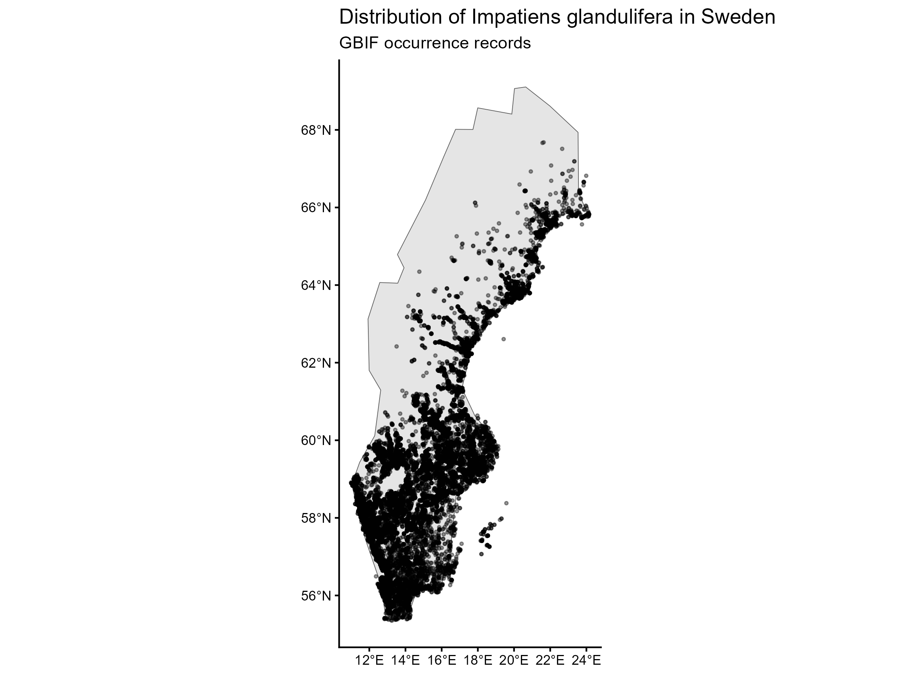
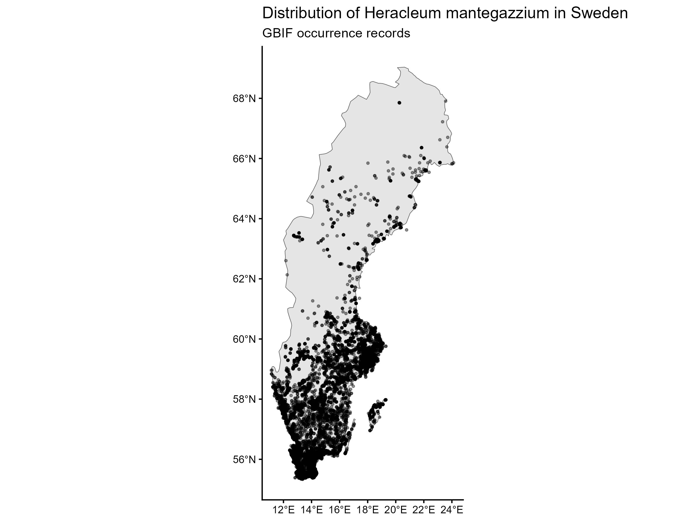
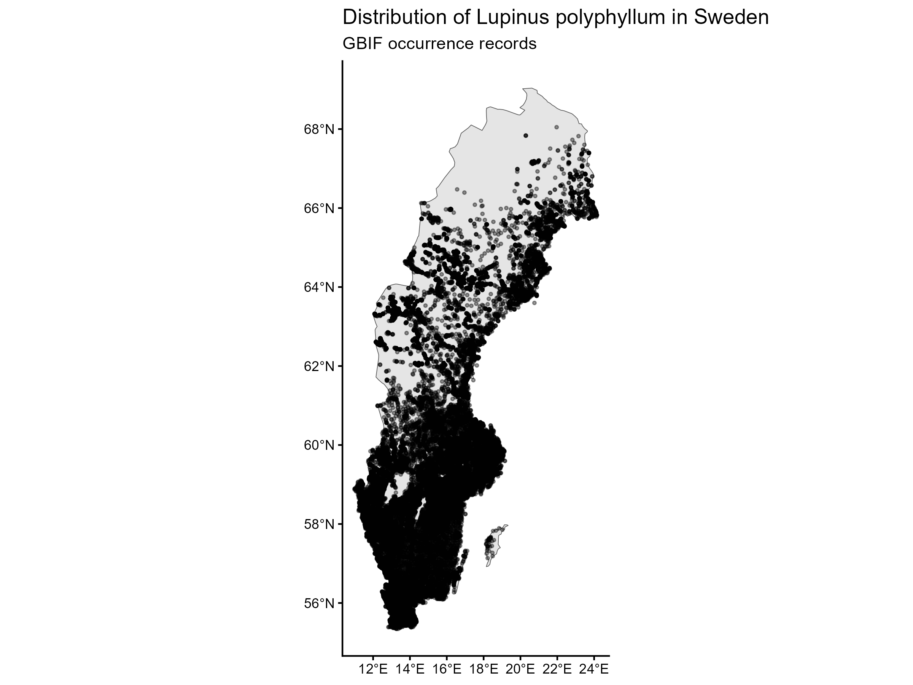
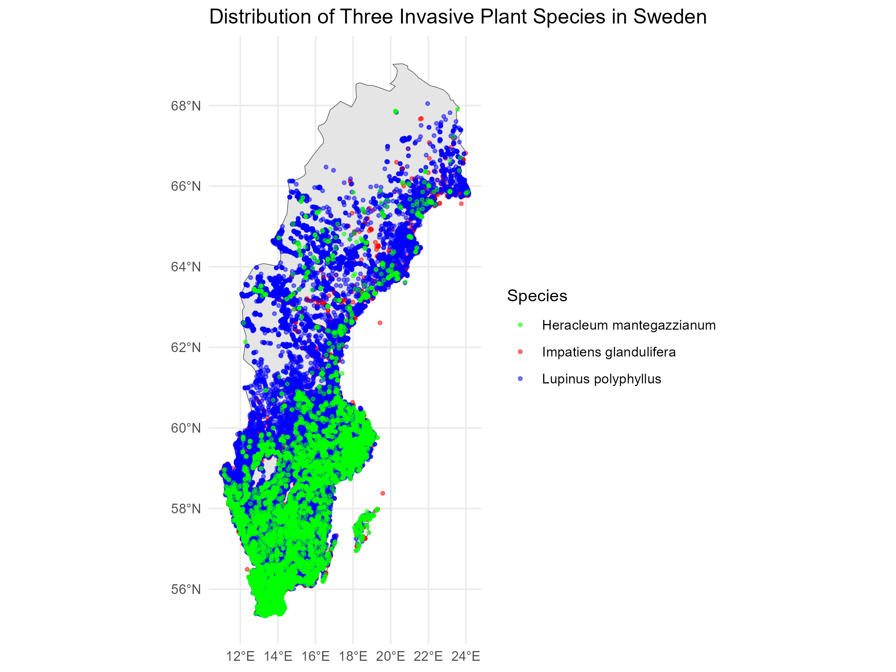
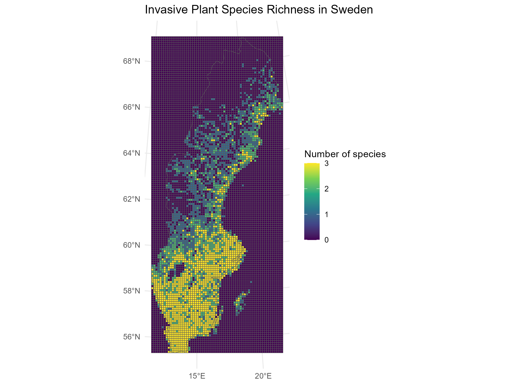
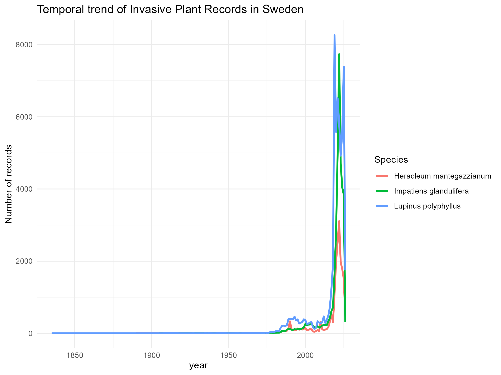

# Distribution mapping and visualization of temporal patterns of Three invasive plant species in Sweden using GBIF data and R programming.
# Overview

The project compares the spatial distribution, species richness patterns and temporal trends of three invasive plant species in Sweden using biodiversity occurrence records from the Global Biodiversity Information Facility (GBIF). The analysis combines biodiversity data cleaning, GIS- based mapping, spatial grid analysis, and temporal visualization to explore where these species occur, where multiple invasive species overlap, and how recorded observations have changed over time.

The analysis was conducted in R using reproducible methods for ecological data processing and spatial analysis workflow.

# Research Question

How are three invasive plant species distributed across Sweden, and how have their recorded occurrence changed through time?

# Study species

¤ Impatiens glandulifera

¤ Lupinus polyphyllus

¤ Heracleum mantegazzianum

# Objectives

Clean and prepare GBIF occurrence datasets.

Create distribution maps for each species.

Produce a combined distribution map.

Identify invasive plant species richness using a spatial grid.

Analyze temporal trends in occurrence records.

# Data Source

Occurrence records were downloaded from the Global Biodiversity Information Facility (GBIF).

The datasets included:

Scientific name

Year

Basis of record

Decimal latitude

Decimal longitude

# Methods

The workflow included:

Data cleaning in R

Removing records without geographic coordinates

Checking coordinate quality

Standardizing species names

Combining cleaned datasets

Spatial analysis using the sf package

Mapping with ggplot2

Coordinate transformation to SWEREF 99 TM (EPSG:3006)

Species richness analysis using a 10 km grid

Temporal trend analysis by year

# Results

This project produced:

Individual distribution maps for each species

The distribution maps shows the recorded occurrence of Impatiens glandulifera, Lupinus polyphylla, and Heracleum mantegazzianum across Sweden based on GBIF occurrence records.

Combined distribution map

The combined map visualizes the spatial distribution of all three invasive plant species, allowing comparison of their occurrence patterns and areas of overlap.

Species richness grid map

The species richness map displays the number of unique invasive plant species recorded within each 10 km × 10 km grid cell. Areas with higher richness indicate locations where multiple invasive plant species have been recorded together. 

Temporal trend graph

The temporal trend graph illustrates the annual number of GBIF occurrence records for each species. The graph reflects changes in recorded observations over time and may also be influenced by variation in sampling effort and biodiversity reporting.

# Conclusion

This project demonstrates how open-access biodiversity data and reproducible R workflows can be used to investigate the distribution, species richness, and temporal patterns of invasive plant species in Sweden. The analyses provide a spatial overview of where invasive plants have been recorded and identify areas where multiple invasive species occur together. This project also highlights the value of combining ecological data cleaning, GIS-based mapping, and temporal analysis for biodiversity research.

# Limitations

* The analyses are based on GBIF occurrence records, which represent recorded observations rather than the true abundance of species.
* Observation density may be influenced by differences in sampling effort, accessibility, and citizen science participation.
* The project does not include environmental variables, habitat characteristics, or statistical modelling of species distributions.

# Future Work

Future improvements could include:

* Species distribution modelling (SDM)
* Analysis of environmental drivers such as climate, land cover, and elevation
* Sampling bias assessment and correction
* Hotspot analysis for invasive species management
* Predictive modelling of future species distributions under climate change

# Acknowledgements

Occurrence data were obtained from the Global Biodiversity Information Facility (GBIF). Spatial analyses and visualizations were performed using R, the **sf** package, and **ggplot2**.

# Author

**Priscilla Gautam**

Master's in Botany | Ecological Data Analysis | GIS | R Programming

This project was developed as part of my portfolio to strengthen skills in ecological data analysis, biodiversity informatics, and reproducible spatial workflows.
